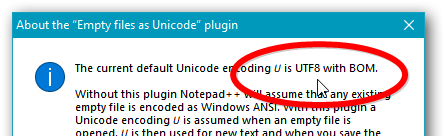
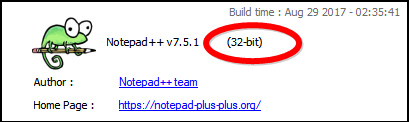

# A Notepad++ plugin: “Empty files as Unicode”

Automatically changes the encoding of empty documents to Unicode.

Without this plugin Notepad++ will assume that any existing empty file is encoded as Windows ANSI. With this plugin a Unicode encoding 𝘜 is assumed, and is used when you add and save some text.

## The plugin’s default encoding 𝘜.

Which Unicode encoding 𝘜 currently is, is listed in the plugin’s fabolous “About…”-box.

&nbsp;&nbsp;&nbsp;&nbsp;&nbsp;&nbsp;&nbsp;&nbsp;

To change 𝘜, change the Notepad++ default via [*Settings* ▷ *Preferences…* ▷ list item *New Document*], and then close and relaunch Notepad++, which forces Notepad++ to save the new default.

I.e. 𝘜 is the encoding last saved as default in the
general Notepad++  options, if that encoding is Unicode. But if that encoding isn’t Unicode,  then 𝘜 is UTF-8 with BOM.

## How and when the 𝘜 encoding is applied.

 When a buffer is activated (e.g. you click on a tab) and has not already been checked:

<ul>
  <li style="list-style-type: none;">if that document is empty and 
  its encoding isn’t already Unicode, then 
  &nbsp; 
  its encoding is set to 𝘜.</li></ul>

## Installation.

You can check whether your Notepad++ is 32-bit or 64-bit in Notepad++’s “About”-box:

&nbsp;&nbsp;&nbsp;&nbsp;&nbsp;&nbsp;&nbsp;&nbsp;

For 32-bit Notepad++ choose the 32-bit DLL **empty-files-as-unicode.32-bit.dll**. For 64-bit Notepad++ choose the 64-bit DLL **empty-files-as-unicode.64-bit.dll**.

Copy the DLL to the **plugins** folder in the Notepad++ installation folder.

E.g. on my machine the Notepad++ installation folder is

> c:\program files (x86)\notepad++

… where the placement in “C:\Program Files (x86)” means that it’s a 32-bit Notepad++. If it had been placed in “C:\Program Files” it would have been 64-bit.

## Contact info.

Author’s mail address: <a href="mailto:alf.p.steinbach+npp@gmail.com?subject=Regarding the “Empty files as Unicode” plugin">alf.p.steinbach+npp@gmail.com</href>.
